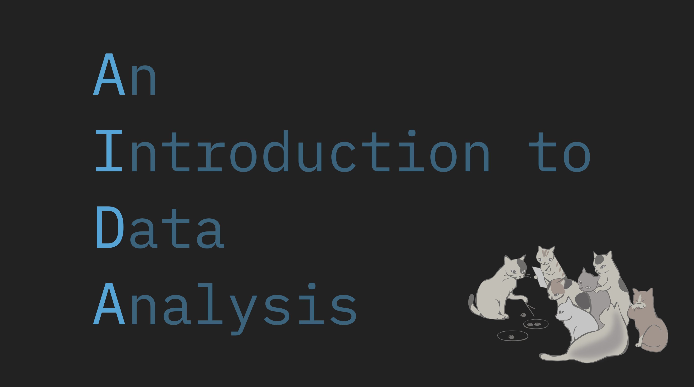

--- 
title: "An Introduction to Data Analysis"
author: "Michael Franke"
date: "last rendered at: `r format(Sys.time(), tz = 'Europe/Berlin')`"
site: bookdown::bookdown_site
output:
  bookdown::gitbook:
    css: [styles.css, webppl-editor.css]
    highlight: kate
    fig_caption: TRUE
    split_by: "section"
    includes:
      in_header: gitbook_header.html
    config:
      toc:
        collapse: section
        scroll_highlight: yes
      download: ["epub", "pdf"]
      sharing: no
  bookdown::epub_book: default
  bookdown::pdf_book: 
    latex_engine: xelatex
    dev: "cairo_pdf"
    highlight: kate
    includes:
      in_header: "la.tex"
documentclass: scrbook
bibliography: [bibliography/book.bib, bibliography/packages.bib]
biblio-style: apalike
link-citations: yes
description: "Introductory text for statistics and data analysis (using R)"
github-repo: "michael-franke/intro-data-analysis"
---


#  {-}

<div style = "float:right; width:100%;">
  
</div>  


This book provides basic reading material for an introduction to data analysis.
It uses R to handle, plot and analyze data. 
After covering the use of R for data wrangling and plotting, the book introduces key concepts of data analysis from a Bayesian and a frequentist tradition.
This text is intended for use as a first introduction to statistics for an audience with some affinity towards programming, but no prior exposition to R.

Many people have supported this project actively by providing text, examples, code or technical support. Many thanks to (in alphabetic order): 
Tobias Anton,
Florence Bockting,
Noa Kallioinen,
Minseok Kang,
Marcel Klehr,
Özge Özenoglu,
Maria Pershina,
Timo Roettger,
Polina Tsvilodub and
Inga Wohlert.

Work on this web-book has been kindly supported financially by the Lower Saxony Ministry for Science and Culture (project "Innovation plus 2020/21").

```{r initialize, echo=FALSE, message=FALSE, warning=FALSE, include=FALSE}
source("00_initialize.R")
```

<script type="text/x-mathjax-config">
  MathJax.Hub.Config({ TeX: { extensions: ["color.js"] }});
</script>

\newcommand{\set}[1]{\left \{ #1 \right \}}
\newcommand{\tuple}[1]{\langle #1 \rangle}
\newcommand{\mult}{\times}

<!-- ## Testing / Showcasing -->

<!-- Don't pay too much attention to what is written here. -->

<!-- ### Quotes -->

<!-- This is a quote: -->

<!-- > Tidy datasets [...] have a specific structure: each variable is a column, each observation is a row, and each type of observational unit is a table. -->
<!-- > -->
<!-- > --- @wickham2014 -->

<!-- ### Infobox -->

<!-- At certain stages, possibly at the end of chapters or after important concepts, we might want to use a special infobox (see `.infobox` in `styles.css`) to summarise it or give food for thought. Like this: -->

<!-- ```{block, type='infobox'} -->
<!-- A horse walks into a bar and orders a pint. The barkeep says "you're in here pretty often. Think you might be an alcoholic?", to which the horse says "I don't think I am.", and vanishes from existence. -->

<!-- See, the joke is about Descartes' famous philosophy of 'I think therefore, I am", but to explain that part before the rest of the joke would be to put Descartes before the horse. -->
<!-- ``` -->

<!-- We can have boxes with different icons for different purposes, using `{block, type='see styles.css'}`: -->

<!-- ```{block, type='questions'} -->
<!-- This might be useful for excercises or general questions. Do you like it? -->
<!-- ``` -->

<!-- ```{block, type='beware'} -->
<!-- Sometimes there are things that are really important, like exceptions to general rules. This box might be appropriate for these. -->
<!-- ``` -->

<!-- To use markdown/latex inside the boxes, use `{block2, ...}`: -->

<!-- ```{block2, type='research'} -->
<!-- ["More research needs to be done"](https://en.wikipedia.org/wiki/Further_research_is_needed) as an infobox. -->
<!-- ``` -->

<!-- And to use entire code blocks _within_ such boxes, we need to make use of raw html (like `<div class="beware">`): -->

<!-- <div class="beware"> -->
<!-- This is just a test. -->

<!-- ```{r, testbox} -->
<!-- # a roll of 5d6 might look like this: -->
<!-- sample(1:6, 5, replace = TRUE) -->
<!-- ``` -->

<!-- Hear, hear! It's 2:30 PM and all is good! -->

<!-- </div> -->


<!-- ### Plots -->

<!-- This is a plot of quite a famous dataset [@anscombe1973]: -->

<!-- ```{r ch-preface-a_plot_example_01, fig.cap="Anscombe's Quartet: four different data sets all of which receive the same correlation score."} -->
<!-- tibble( -->
<!--   grp = rep(c("I", "II", "III", "IV"), each = 11), -->
<!--   x = c(anscombe$x1, anscombe$x2, anscombe$x3, anscombe$x4), -->
<!--   y = c(anscombe$y1, anscombe$y2, anscombe$y3, anscombe$y4) -->
<!-- ) %>%  -->
<!--   ggplot(aes(x, y)) + -->
<!--     geom_smooth(method = lm, se = F, color = "black") + -->
<!--     geom_point(color = project_colors[3], size = 2) + -->
<!--     scale_y_continuous(breaks = scales::pretty_breaks()) + -->
<!--     scale_x_continuous(breaks = scales::pretty_breaks()) + -->
<!--     labs(title = "Anscombe's Quartet", x = NULL, y = NULL, -->
<!--          subtitle = bquote(y == 0.5 * x + 3 ~ (R^2 %~~% .667) ~ "for all datasets")) + -->
<!--     facet_wrap(~grp, ncol = 2, scales = "free_x") + -->
<!--     theme(strip.background = element_rect(fill = "#f2f2f2", colour = "white")) -->
<!-- ``` -->

<!-- Here's a plot showcasing our custom palellet for discrete factors: -->

<!-- ```{r ch-preface-Setosa, fig.cap="A figure to test the contrast of the first three project colors"} -->
<!-- ggplot(iris, aes(x = Sepal.Length, y = Sepal.Width, color = Species)) + geom_point(size=3) -->
<!-- ``` -->

<!-- ### Shiny Apps -->

<!-- Embedding Shiny Apps is as easy as pie! -->

<!-- ```{r shiny_example} -->
<!-- knitr::include_app("https://marauderpixie.shinyapps.io/dist_chisq/", height = "800px") -->
<!-- ``` -->
