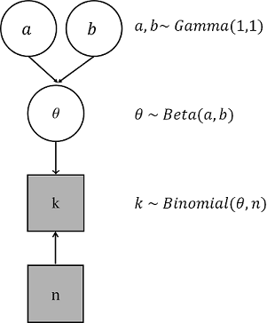
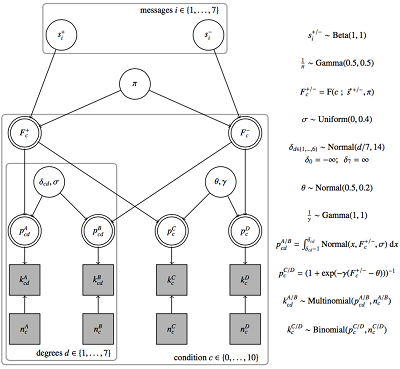

# Snippets from revised chapters

## Model examples

### Example 1: a single draw from an urn {#Chap-03-03-models-general-urn-example}

In front of us is an urn. We cannot see what is inside. We assume (!) that there are $N = 10$ balls in the urn and that any number $0 \le k \le 10$ is black, the rest white. Our data is minimal. There is only one variable, which therefore is also our dependent variable. We have drawn a ball from the urn once, and we observed that it is black.

```{r}
minimal_data_from_an_urn <- 
  tribble(~ draw, c("black"))
```

So far, so boring. But what is a reasonable parameterized likelihood function for this case? -- Well, we do not know what the content of the urn is but, given our (modeling) assumptions, there are only eleven possible states of the world $k \in \{0, 1, \dots, 10\}$. If we assume (as part of the model structure) that the total number of balls $N$ in the urn is known $N = 10$, then the number $k$ of black balls in the urn straightforwardly entails the likelihood of the data:

$$ P_M(D = \text{"black"} \mid k) = \frac{k}{N}$$

```{block, type='beware'}
It is important to realize that this (and any other likelihood function) defines the probability, not only of the observed data, but for the whole class of *observable data*, including observations that are only logically conceivable, but possibly ruled out by the model.
```

The model of the single-draw random process has a single free parameter $k$, which feeds into the likelihood function. We naturally think of the likelihood of the data as probabilistically dependent on the parameter value $k$.

A Bayesian model of this situation would additionally include a *prior* over parameter values. There are only eleven possible values for $k$, so this is a discrete probability distribution. If we do not have any relevant *a priori* knowledge of the process, we might want to assign the same probability to each value of $k$:

$$ P_M(k = i) = \frac{1}{11} \text{; for all } \ i \in \{0, 1, \dots, 10\} $$

<div class = "exercises">
**Exercise 8.1**   

 Calculate the probability of observing no more than 7 successes for $N= 24$ and $\theta =0.2$.
 
<div class="collapsibleSolution">
<button class="trigger">Solution</button>
<div class="content">


```{r, echo = F}
  pbinom(7, 24, 0.2)
```
</div>
</div>
</div>

### Example 2: avocado prices by type

<div style = "float:right; width:11%;">

</div>

We must also consider a slightly less minimalist example. The [avocado data set](#app-93-data-sets-avocado) is useful for that. As before, we load the data into a variable named `avocado_data` and do some minor data wrangling (see also Appendix Chapter \@ref(app-93-data-sets-avocado)):

```{r, echo = F}
avocado_data <- read_csv('data_sets/avocado.csv',
                         col_types = cols(
                           X1 = col_double(),
                           Date = col_date(format = ""),
                           AveragePrice = col_double(),
                           `Total Volume` = col_double(),
                           `4046` = col_double(),
                           `4225` = col_double(),
                           `4770` = col_double(),
                           `Total Bags` = col_double(),
                           `Small Bags` = col_double(),
                           `Large Bags` = col_double(),
                           `XLarge Bags` = col_double(),
                           type = col_character(),
                           year = col_double(),
                           region = col_character()
                         )) %>% 
  # remove currently irrelevant columns
  select( -X1 , - contains("Bags"), - year, - region) %>% 
  # rename variables of interest for convenience
  rename(
    total_volume_sold = `Total Volume`,
    average_price = `AveragePrice`,
    small  = '4046',
    medium = '4225',
    large  = '4770',
  )
```

```{r, eval = F}
avocado_data <- read_csv(url('https://raw.githubusercontent.com/michael-franke/intro-data-analysis/master/data_sets/avocado.csv')) %>% 
  # remove currently irrelevant columns
  select( -X1 , - contains("Bags"), - year, - region) %>% 
  # rename variables of interest for convenience
  rename(
    total_volume_sold = `Total Volume`,
    average_price = `AveragePrice`,
    small  = '4046',
    medium = '4225',
    large  = '4770',
  )
```

We are interested in the random process that generates avocado prices. The data relevant for modeling this random process contains `average_price` as the dependent variable and `type` as the independent variable. We could also say that we are interested in predicting / explaining the average prices in terms of the avocado type.To get a feeling for how the data to be modeled looks like, here are histograms for the price data for conventionally and organically grown avocados:

```{r}
avocado_data %>% 
  ggplot(aes(x = average_price, fill = type)) +
  geom_histogram(binwidth = 0.01) +
  facet_wrap(type ~ ., ncol = 1) + 
  ylab('') +
  xlab('Average price') +
  theme(legend.position = "none")
```


Our model assumes that the data observations in `average_price` are samples from a normal distribution, whose mean $\mu$ and standard deviation $\sigma$ are free parameters, one pair of $\mu$ and $\sigma$ for each `type` of avocado. So, this model has four free parameters, which constitute the parameter vector $\theta = \langle \mu_c, \sigma_c, \mu_o, \sigma_o \rangle$. As for the likelihood function, if $\vec{y}$ is the vector `average_price`, so that $y_i \in \mathbb{R}^+$ is the average price observed in row $i$, and if $\vec{x}$ is an indicator variable such that $x_i \in \{ 1, 0\}$ is the entry for the type of avocado in line $i$ where 1 represents conventionally grown and 0 represents organically grown, and if there are $k$ rows in the data set, the likelihood function can be written as:

$$ P_M(\vec{y} \mid \vec{x}, \theta) = 
\prod_{i = 1}^k x_i \ \text{Normal}(y_i, \mu_c, \sigma_c) \ + \ (1- x_i) \  \text{Normal}(y_i, \mu_o, \sigma_o)  $$


<div class = "exercises">
**Exercise 8.2**   

Fill in the gaps in the code chunk below to fix the likelihood function.

```{r, eval=FALSE}
lh_ttest <- function(__, __, mu, sigma, __) {
  prod(dnorm(__, mu, sigma, log = F)) * prod(dnorm(__, mu + __, sigma, log = F))
}
```

<div class="collapsibleSolution">
<button class="trigger">Solution</button>
<div class="content">

```{r}
lh_ttest <- function(y0, y2, mu, sigma, delta) {
  prod(dnorm(y0, mu, sigma, log = F)) * prod(dnorm(y1, mu + delta, sigma, log = F))
}
```
</div>
</div>
</div>


If we aspire to handle a Bayesian model, we need to supply a prior for parameters $\theta$ as well. General strategies of fixing priors for Bayesian data analysis are discussed in the next subsection. To give a concrete example for this case, we could assume that all parameter vectors are independent of each other and assume that the means $\mu_c$ and $\mu_o$ are themselves normally distributed. We could use a *truncated normal distribution*^[A truncated normal distribution is like a normal distribution, but restricted to a certain range of possible values. In general, if $P$ is a continuous probability distribution on some interval which properly contains $[a;b]$, a truncated version of $P$ to the interval $[a;b]$ such that:
$$ \text{Trunc-}P(x, \text{min} = a, \text{max} = b) = 
\begin{cases} 
\frac{P(x)}{\int_{a}^{b} P(x') \text{d}x'} & \text{ if } a \le x \le b \\
0 & \text{otherwise}
\end{cases} $$ 
] as the priors for the standard deviations $\sigma_c$ and $\sigma_o$:

$$ 
\begin{aligned}
  P(\mu_c, \sigma_c, \mu_o, \sigma_o) & = P(\mu_c) \ P(\sigma_c) \ P(\mu_o) \ P(\sigma_o), \text{ where} \\
  P(\mu_c) & = \text{Normal}(\mu_c, \mu = 1.5, \sigma = 0.25)  \\
  P(\mu_o) & = \text{Normal}(\mu_o, \mu = 1.5, \sigma = 0.25)  \\
  P(\sigma_c) &= \text{Trunc-Normal}(\sigma_c, \mu = 0.2, \sigma = 0.05, \text{lower} = 0) \\
  P(\sigma_o) &= \text{Trunc-Normal}(\sigma_o, \mu = 0.25, \sigma = 0.1, \text{lower} = 0)
\end{aligned}
$$

## More on notation for models

### Multiple observations

When we have several observations, like in the avocado price data set, we use indexed variables. For example, the likelihood function handled in Section \@ref(Chap-03-03-models-general) for modeling avocado prices as a function the type of avocado was previously written like so:

$$ P_M(\vec{y} \mid \vec{x}, \theta) = 
\prod_{i = 1}^k x_i \ \text{Normal}(y_i, \mu_c, \sigma_c) \ + \ (1- x_i) \  \text{Normal}(y_i, \mu_o, \sigma_o)  $$

An alternative notation for this likelihood function achieves conciseness with the help of the `~` symbol:

$$ y_i \sim \begin{cases} \text{Normal}(\mu_c, \sigma_c) & \text{if} \ x_i = 1 \\ 
\text{Normal}(\mu_0, \sigma_0) & \text{otherwise} \\ \end{cases} $$ 

Notice that this latter notation makes clearer than the previous that each observation in vector $\vec{y}$ is an **independent draw** from a given distribution in the sense that the likelihood of $y_i$ does not depend on the value of any other $y_j$. We see the independence of each $y_i$ from any other observation $y_j$ in the notation $y_i \sim \dots$ when the distribution on the RHS does not contain any reference to $y_j$, as is the case in this example. If all $y_i$ are independent samples, we also understand implicitly from this notation that the likelihood of the whole data is to be calculated as the product of the likelihood of each individual observation. This is because the probability of the conjunction of two stochastically independent events is the product of their individual probabilities (see Chapter \@ref(Chap-03-01-probability-independence)).

In the graphical representation, we may conveniently group variables with the same index together in dotted boxes, like shown below for the T-Test Model, which is introduced in the next section:

```{r, echo = F, out.width = '80%'}
knitr::include_graphics("visuals/t-test-model.png")
```

The aforementioned T-Test Model uses different probability distributions for each (independent) draw of $y_i$. This is, of course, not always the case. The graph below shows the structure of a Linear Regression Model (explained in more detail in the next section), where each $y_i$ is assumed to be an *independent* draw from the *same* distribution. This is often written as "**iid**": **i**ndependent of all other observations and **i**dentically **d**istributed just like all other observations.^[With slight but pragmatically justifiable abuse of terminology, we could still speak of the observations $y_i$ in the T-Test Model as iid (independently and identically distributed) if we contextually enrich the intended meaning of "identically distributed" in the obvious way to mean "identically distributed *given the group the observation $i$ belongs to*".]

```{r, echo = F, out.width = '80%'}
knitr::include_graphics("visuals/linear-regression-model.png")
```

<div class = "exercises">
**Exercise 8.5**

TRUE or FALSE?

a. For the Binomial model, observed variables are the number of trials and the probability of success.

b. In the graphical representation for the T-test model, $g_i$ stands for "$group_i$".

c. A Binomial model can have only discrete observed variables. 

d. In a Linear Regression model, $y_i$ is determined by its underlying distribution.

<div class="collapsibleSolution">
<button class="trigger">Solution</button>
<div class="content">

a. False

b. True

c. True

d. False

</div >
</div >
</div >


## Three pillars of data analysis {#Chap-03-03-models-three-pillars}

There are three main uses for models in statistical data analysis:

1. **Parameter estimation**: Based on model $M$ and data $D$, we try to infer which value of the parameter vector $\theta$ we should believe in or work with (e.g., base our decision on). Parameter estimation can also serve knowledge gain, especially if (some component of) $\theta$ is theoretically interesting.
2. **Model comparison**: If we formulate at least two alternative models, we can ask which model better explains or better predicts some data. In some of its guises, model comparison helps with the question of whether a given data set provides evidence in favor of one model and against another other, and if so, how much.
3. **Prediction**: Models can also be used to make predictions about future or hypothetical data observations. 

The frequentist and the Bayesian approach each have their specific methods and techniques to do estimation, comparison, and prediction. Even within each approach (frequentist or Bayesian) and a particular goal (estimation, comparison, or prediction) there is not necessarily unanimity about the best method or technique. 

Table \@ref(tab:ch-03-03-pillars-of-DA) lists the most common/salient methods used for each goal in the frequentist and Bayesian approach. A large part of the remainder of this course will be dedicated to understanding the methods name-dropped in this table, and to compare them against each other and further, as of yet unmentioned alternatives. Chapter \@ref(Chap-03-06-model-comparison) deals with model comparison, Chapter \@ref(ch-03-04-parameter-estimation) with parameter estimation. The second main goal of this course is to understand the relation between model-based data analysis, as summarized in Table \@ref(tab:ch-03-03-pillars-of-DA), to test-based approaches as described in Chapter \@ref(ch-03-05-hypothesis-testing) and Chapter \@ref(ch-03-07-hypothesis-testing-Bayes).

```{r ch-03-03-pillars-of-DA, echo = F}
table_data <- tribble(
  ~`inferential goal`, ~target, ~frequentist, ~Bayesian,
  "estimation", "$\\theta$",  "MLE: $\\hat{\\theta} = \\arg \\max_{\\theta}\  P_M(D \\mid \\theta)$", "posterior: $P_M(\\theta \\mid D)$",
  "comparison", "$M$", "AIC, LR-test", "Bayes factor",
  "prediction", "$D$", "MLE-based: $P_M(D_{rep} \\mid \\hat{\\theta})$", "Posterior-based: $P_M(D_{rep} \\mid D)$"
)
knitr::kable(
  table_data,
  escape = F,
  caption = "Most common/salient methods of frequentist and Bayesian approaches for the three major goals of model-based data analysis. The abbreviations used are: MLE for 'maximum likelihood estimate', AIC for 'Akaike information criterion', LR-test for 'likelihood-ratio test' and $D_{rep}$ for 'repeat data'.", 
  booktabs = TRUE
)
```


The three pillars of data analysis mentioned above are tightly related, of course. For one, model comparison is often parasitic on prediction: whereas prediction asks which data is to be expected, given the model, model comparison looks at how well a given data set is or would have been predicted by different models. For another, parameter estimation and data predictions are something like each other's reverse operations. Let's elaborate on the latter briefly.

If we flip a coin once, the likelihood of each outcome $x \in X = \{0;1\}$ (representing heads or tails, encoded as 1 and 0, respectively) can be modeled with the **Bernoulli distribution** as follows, where $\theta \in [0;1]$ is the coin's bias towards landing heads:

$$P_M( X = x \mid \theta)=\theta^{[x]}(1-\theta)^{(1-[x])}$$

This likelihood function relates two variables of interest: the coin flip outcome (= data $D$) $x$ and the coin's bias (= model parameter $\theta$). Depending on what is given or assumed to be known, we can then use the same likelihood function, to either infer something about the unknown parameter $\theta$ or, when $\theta$ is given make predictions about the unknown outcome $x$. 

To make this even clearer, we can temporarily use the following bracket notation: the bracket $[ \cdot ]$ indicates that the bracketed parameter is treated as known, given or assumed. The **predictive distribution** for unknown data $x$ is then:

$$\text{Predictive Distribution: }\ \ \ \ F(\theta) = P_M(X=x \mid [\theta])=[\theta]^x(1-[\theta])^{(1-x)}$$


But often the contrary is the case, that is one is interested in the value of $\theta$ by a given data set. Then $\theta$ is unknown and the data are observed. Treating $\theta$ as a parameter instead of $x$ leads to the *likelihood function* --- a mathematical formula that specifies the plausibility of the data as a function of $\theta$. It states the probability of any possible observation:
$$\text{Likelihood Function: }\ \ \ \ F(x) =P_M( [X = x] \mid \theta)=\theta^{[x]}(1-\theta)^{(1-[x])}$$
 Figure \@ref(fig:ch-03-03-likelihood-distribution) shows the likelihood function associated with the one-coin-flip model when the observed and known outcome is $x = 1$ (heads). Notice that the likelihood function is not a probability distribution and thus does not necessarily integrate or sum to 1, even though it does in the case at hand.

```{r ch-03-03-likelihood-distribution, echo = FALSE, fig.cap= "Bernoulli likelihood for the one-coin-flip-model with observed outcome $x =1$ (heads)."}
# x-axis
stepsize <- 100
theta = seq(from = 0, to = 1, by = 1/stepsize)

# beroulli likelihood
likelihood_bern <- tibble(
  theta = theta,
  n = 1,                                    # number of observations
  k = 1,                                    # number of heads
  likelihood = (theta^k)*(1-theta)^(n-k)     # bernoulli likelihood
) %>%
mutate(likelihood_norm = (likelihood / sum(likelihood)*stepsize)
           )
# plot likelihood
ggplot(likelihood_bern, aes(x = theta, y = likelihood_norm)) +
  geom_line(size = 2) +
  labs(x = expression(theta), y = "Likelihood")
```

### Two notions of probability (revisited)

To understand why frequentist models do not have priors, but Bayesian models do, we need to revisit the interpretation of the notion of probability, in particular frequentism and subjectivism. We should be reminded that although both notions imply different approaches to the problem of how to deal with probabilities, the mathematical properties are quite similar [@kruschke2015].

A crude and overly simplified version of why frequentist models do not contain priors is this. Extreme frequentism denies that a probability distribution over a latent parameter like $\theta$ is meaningful. It cannot be justified or defended in a scientifically rigorous manner. The only statements about probabilities that are conceptually sound, according to a fundamentalist frequentist interpretation, are those that derive from intuitions about limiting frequencies when (hypothetically) performing a random process (like throwing a dice or drawing a ball from an urn). Bluntly put, there is no "(thought) experiment" which can be repeated so that its objective results, on average, align with whatever subjective prior beliefs the Bayesian analysis needs. As a result, the frequentist approach to statistical inference needs alternative methods for parameter estimation --- methods that do \emph{not} rely on (subjective) priors $P(\theta)$.

Of course, the objections to the use of priors could be less fundamentalist. Researchers who have no metaphysical troubles with subjective priors in principle might reject the use of priors in data analysis because they feel that the necessity to specify priors is a burden or a spurious degree of freedom in empirical science. Thus, priors should be avoided to stay as objective, procedurally systematic, and streamlined as possible.

In contrast, adopters of Bayesian practices see added value in using priors (expression of prior knowledge, practicality) that exceeds any conceptual or procedural difficulties they see in the process of specification of priors. When uncertain about a particular choice of prior, a good Bayesian practice is a *robustness analysis*: exploring how conclusions or decisions depend on the specification of the prior. As we will see, given enough data, the effect of prior specifications can be washed out. This is intuitive: no matter what you believe initially, given enough empirical evidence, you will eventually be persuaded to leave your original beliefs behind.


## Strolling the zoo of models {#Chap-03-03-models-examples}

Let's have a look at some more models. Some of the characters we will encounter here will play leading roles in the plot to come. Some are for familiarization and exercise. All are pleasant.

### The Binomial Model {#Chap-03-03-models-examples-binomial}

We just repeat the Binomial Model discussed above for completeness in Figure \@ref(fig:ch-03-02-Binomial-Model-repeated).

```{r ch-03-02-Binomial-Model-repeated, echo = F, fig.cap="The Binomial Model (repeated from before).", out.width = '40%'}
knitr::include_graphics("visuals/binomial-model.png")
```

### Flip-and-Draw Model

The Flip-and-Draw Model is a model for the flip-and-draw scenario introduced in Section \@ref(Chap-03-01-probability-marginal). Remember that we first flip a coin and then draw from one of two urns, depending on the outcome of the coin flip. Let's generalize this and assume that the coin has a possibly unknown bias $\theta$. The probability of sampling a black or white ball from the first urn is given by a probability vector $\vec{p_0} = \langle 0.2, 0.8 \rangle$ (where the first entry gives the probability of sampling a black ball). The other urn has a corresponding probability vector $\vec{p_1} = \langle 0.4, 0.6 \rangle$. The [categorical distribution](https://en.wikipedia.org/wiki/Categorical_distribution) gives the probability of sampling an index from a given probability vector $\vec{p}$. It is defined as:

$$ \text{Categorical}(i) = \vec{p}_i $$

Figure \@ref(fig:ch-03-02-FlipDraw-Model) gives a concise representation of the model.

```{r ch-03-02-FlipDraw-Model, echo = F, fig.cap="The Flip-and-Draw Model.", out.width = '30%'}
knitr::include_graphics("visuals/flip-and-draw-model.png")
```

### Flip-and-Draw-Hypergeometric Model

The Flip-and-Draw-Hypergeometric Model is exactly like the previous Flip-and-Draw Model, except that we allow ourselves to sample repeatedly *without replacement* from an urn the coin flip selected for us. The probability of observing $k$ black balls when drawing $n$ balls from an urn that contains $N$ balls in total, out of which $K$ balls are black, and we do not put each drawn ball back into the urn is described as the so-called [hypergeometric distribution](https://en.wikipedia.org/wiki/Hypergeometric_distribution). The hypergeometric distribution assigns to each $k \in \{\max(0, n+K-N), \dots, \min(n,K)\}$ the probability mass:

$$ \text{Hypergeometric}(k \mid n, K, N) = \frac{\binom{K}{k} \binom{N-K}{n-k}}{\binom{N}{n}}  $$

Suppose we keep the total number of urns fixed to $N = 100$ and always draw $n = 20$ balls. The two urns we have (indexed 0 and 1) hold $K_0 = 20$ and $K_1 = 80$ black balls. For a Bayesian model we could use a $\text{Beta}$ prior for $\theta$. Figure \@ref(fig:ch-03-02-FlipDraw-Hypergeometric) shows the model.

```{r ch-03-02-FlipDraw-Hypergeometric, echo = F, out.width = '60%', fig.cap="The Flip-and-Draw-Hypergeometric Model."}
knitr::include_graphics("visuals/flip-and-draw-hypergeometric.png")
```

Below is WebPPL code that allows you to test the models' predictions about data. You can manipulate the parameter values for $\theta$ and $K_1$ and $K_2$. The latter are represented in the array/vector `K = [K1, K2]` below.^[To learn about WebPPL the fast way, try [this tutorial](http://www.problang.org/chapters/app-06-intro-to-webppl.html).]

<pre class="webppl">
var theta = 0.2; var K = [20,80];
///fold:
var N = 100;
var n = 20;

var factorial = function(x) {
  if (x < 0) {return "input to factorial function must be non-negative"}
  return x == 0 ? 1 : x * factorial(x-1)
}

var binom = function(a, b) {
  var numerator = factorial(a)
  var denominator = factorial(a-b) *  factorial(b)
  return numerator / denominator
}

// urn contains N balls of which K are black
// and N-K are white; we draw n balls at random
// without replacement; what's the probability
// of obtaining k black balls?
var hypergeometricPMF = function(k,N,K,n) {
  k > Math.min(n, K) ? 0 :
  k < n+K-N ? 0 :
  binom(K,k) * binom(N-K, n-k) / binom(N,n)
}

var hypergeometricSample = function(N,K,n) {
  var support = _.range(N+1) // possible values 0, ..., N
  var PMF = map(function(k) {hypergeometricPMF(k,N,K,n)}, support)
  categorical({vs: support, ps: PMF })
}
viz(Infer({model: function() {var K_urn = K[flip(theta) ? 1 : 0];
                              hypergeometricSample(N, K_urn, n)},
           method: "forward",
           samples: 1500}))
///
</pre>

<pre class=" CodeMirror-line " role="presentation">
</pre>

<script>
// find all <pre> elements and set up the editor on them
var preEls = Array.prototype.slice.call(document.getElementsByClassName("webppl"));
preEls.map(function(el) { console.log(el); editor.setup(el, {language: 'webppl'}); });
</script>


<!-- <!-- Ex.Maybe for HW? -->
<!-- You want to approximate how many people visited your webpage for the first time today.  You know that overall 50 people were there. And you see 7 comments, five of which are left by your old followers. Print the most likely number of new visitors.  -->

<!-- ```{r} -->

<!-- ll_new_visitors <- tibble( -->
<!--     m = 2:45, -->
<!--     LH = dhyper(2, m, 50,7) -->
<!-- ) %>%  -->
<!-- which(ll_new_visitors==max(ll_new_visitors["LH"])) -->

<!-- ``` -->

<!-- -->

### T-Test Model: comparing two groups

Consider the example introduced in Section \@ref(Chap-03-03-models-general) again, where we set out to compare the means of average prices of different types of avocados. We assume that there is an indicator variable $g_i$ (corresponding to `type`), such that, for example, $g_i = 0$ is for observations from organic avocados and $g_i = 1$ is for observations from conventionally grown avocados. A first instance from the T-Test Model family for the comparison of two groups assumes that the first group has a mean $\mu_0$ and the second has $\mu_1$, while both share the same standard deviation $\sigma$. Using the notation developed in Section \@ref(Chap-03-03-models-representation), we can write the likelihood function succinctly like so:

$$ y_i \sim \text{Normal}(\mu_{g_i}, \sigma) $$ 

In a Bayesian approach, the priors over parameter values could use a normal distribution for $\mu_i$ and a truncated normal distribution for $\sigma$ (since $\sigma$ must be positive). Figure \@ref(fig:ch-03-02-Simple-Linear-Regression) shows the resulting model.

```{r ch-03-02-T-Test-Model, echo = F, out.width = '70%', fig.cap="A T-Test Model where each group has its own mean."}
knitr::include_graphics("visuals/t-test-model.png")
```

A point of general importance can be made in connection with this example. It is possible to build different prior structures around the same likelihood function. Some parameterizations can be more useful for a given purpose than others. Some parameterizations make it easier to formalize prior domain knowledge than others. To see this, consider the case at hand where we might be specifically interested in the question of how big the difference between the means is. We can therefore also level the model shown in Figure \@ref(fig:ch-03-02-T-Test-Model-Difference).


```{r ch-03-02-T-Test-Model-Difference, echo = F, out.width = '70%', fig.cap="A T-Test Model where one group is the default and the difference between group means is explicitly coded as a parameter."}
knitr::include_graphics("visuals/t-test-model-difference.png")
```

The variant of the T-Test Model, formulated in terms of differences between groups, in Figure \@ref(fig:ch-03-02-T-Test-Model-Difference) is what is usually used in common practice. The advantage is, for example, that it is easy to address the question whether the means are identical, a case which is represented by a single parameter value $\delta = 0$ (rather than an infinite set of pairs $\mu_0 = \mu_1$). It is also easier to specify beliefs about the differences between groups. The prior on $\delta$ in Figure \@ref(fig:ch-03-02-T-Test-Model-Difference) assumes that we expect *a priori* that $\delta = 0$, but specifying different standard deviations for this prior allows to formalize different degrees of certainty. We could for example use a *skeptical prior*, i.e., an initial model configuration that is skeptical about a group difference, if the standard deviation is set very low.

### Simple Linear Regression Model

In Section \@ref(Chap-02-04-ggplot), we plotted avocado prices in a scatter plot. In particular, we plotted (the log of) `average_price` as a function of `total_amount_sold`, and we also added a regression line, like so:

```{r, echo = F}
avocado_data %>% 
  ggplot(
    mapping = aes(
      # notice that we use the log (try without it to understand why)
      x = log(total_volume_sold),
      y = average_price
    )
  ) +
  # add a scatter plot
  geom_point(alpha = 0.3) +
  # add a linear regression line
  geom_smooth(method = "lm")
```

A simple linear regression tries to relate pairs of associated observations, frequently denoted as $x_i$ and $y_i$. Here, $i$ is an index over observations, $x_i$ is the (continuous) independent variable and $y_i$ is the (continuous) dependent variable. In our example, the vector $x$ is the logarithm of `total_amount_sold` and $y$ is the vector `average_price`. The simple linear regression model assumes that there is a simple linear relationship between $x$ and $y$. A perfect linear relationship would exist if for all $i$:

$$ y_i = \beta_0 + \beta_1 \ x_i $$

Given measurement error and other lingering uncertainties, we rather handle a **linear relation with stochastic noise**, in which the linear relationship holds, but could be distorted by an $\epsilon$ error, which we assume is independently drawn for each $i$ from a normal distribution:

$$ y_i = \beta_0 + \beta_1 \ x_i + \epsilon_1 \ \ \ \ \ \ \text{where} \ \ \ \ \epsilon_i \sim \text{Normal}(\mu=0, \sigma = \dots)$$

An alternative formulation is to simply write: 

$$ y_i \sim \text{Normal}(\mu=\beta_0 + \beta_1 \ x_i , \sigma = \dots)$$

This is the likelihood function that the Simple Linear Regression Model assumes. Figure \@ref(fig:ch-03-02-Simple-Linear-Regression) summarizes the full model by also indicating roughly which kinds of prior distributions might be useful in a Bayesian analysis.

```{r ch-03-02-Simple-Linear-Regression, echo = F, out.width = '60%', fig.cap="The Simple Linear Regression Model."}
knitr::include_graphics("visuals/linear-regression-model.png")
```

### Linear Regression with Two Groups {#Chap-03-03-models-examples-linear-regression}

Section \@ref(Chap-02-04-ggplot) also plotted avocado prices against the total amount sold and distinguished the type of avocado, also adding a separate regression line for each type. The result looked like this:

```{r, echo = F}
# pipe data set into function `ggplot`
avocado_data %>% 
  # reverse factor level so that horizontal legend entries align with
  # the majority of observations of each group in the plot
  mutate(
    type = fct_rev(type)
  ) %>% 
  # initivalize the plot
  ggplot(
    # defined mapping
    mapping = aes(
      # which variable goes on the x-axis
      x = total_volume_sold, 
      # which variable goes on the y-axis
      y = average_price, 
      # which groups of variables to distinguish
      group = type, 
      # color and fill to change by grouping variable
      fill = type, 
      linetype = type,
      color = type
    )
  ) +
  # declare that we want a scatter plot
  geom_point(
    # set low opacity for each point
    alpha = 0.1
  ) +
  # add a linear model fit (for each group)
  geom_smooth(
    color = "black", 
    method = "lm"
  ) +
  # change the default (normal) of x-axis to log-scale
  scale_x_log10() +
  # add dollar signs to y-axis labels
  scale_y_continuous(labels = scales::dollar) +
  # change axis labels and plot title & subtitle
  labs(
    x = 'Total volume sold (on a log scale)',
    y = 'Average price',
    title = "Avocado prices against amount sold",
    subtitle = "With linear regression lines"
  )
```

Towards a model that computes these linear regression lines, one for each group, that is in line with the idea introduced above that, for the purposes of estimation and testing, we might like to represent differences between groups as $\delta$ parameters in a model, let's assume that the type of avocado is our grouping variable $g_i$. The default group (say: conventional avocados) has $g_i = 0$, the other group has $g_i = 1$. The first group gets "its own" intercept $\beta_0$ and slope $\beta_1$. The second group gets additive offsets $\delta_0$ and $\delta_1$ for its slope and intercept, respectively. The full model is shown in Figure \@ref(fig:ch-03-02-Linear-Regression-Groups).

```{r ch-03-02-Linear-Regression-Groups, echo = F, out.width = '80%', fig.cap="The Linear Regression with Two Groups Model."}
knitr::include_graphics("visuals/linear-regression-with-groups.png")
```


<div class = "exercises">

**Exercise 8.6**   

Which model would you rather use to investigate...

a. ...if there is a difference between chocolate consumption per person in Germany and Belgium?

b. ...how many people visited your webpage for the first time? You know that overall 50 people were there. And you see 7 comments, five of which are left by your old followers.  

c. ...if running speed increases with every 100m among sprinters, but not within marathoners?

d. ...the relationship between the time spent on studying and the amount of coffee consumption?

e. ...if a football referee is biased and gives yellow cards more often to one of the teems? Consider that the fold probability is known for each team.
 
<div class="collapsibleSolution">
<button class="trigger">Solution</button>
<div class="content">

a. T-Test Model

b. Flip-and-Draw-Hypergeometric Model

c. Linear Regression with Two Groups

d. Simple Linear Regression Model

e. Binomial

</div>
</div>
</div>


<!-- ### Outlook: Hierarchical models -->

<!-- Often data can be considered as part of an overall structure. Single observations can be modelled belonging into different groups. These groups in turn are part of a superordinate group etc. Such information are presented in a model in form of a hierarchy. -->

<!-- For example, consider again the coin flip experiment. The outcome of *head* is influenced by the probability $\theta$. Further, $\theta$ is assumed to be distributed as Beta(1,1). Remember that the parameter a and b of a Beta-distribution can be considered in this context as: $a=$number of heads and $b=$ number of tails, consequently, $n=a+b$. -->

<!-- #### Reparameterization of a Beta distribution -->

<!-- Probability distributions can be described by their *central tendency* and *spread* (or dispersion). The *mode* of a Beta distribution is defined as: -->

<!-- $\omega=\frac{a-1}{a+b-2}$, -->

<!-- and the concentration as: -->

<!-- $\kappa=a+b.$ -->

<!-- The nice thing is, that the definition of the *mode* as well as of the *concentration* consists solely of the parameters a and b. Therefore, it is possible to re-express the parameters of a Beta density in terms of $\omega$ and $\kappa$, such that: -->

<!-- $$Beta(a,b)=Beta\left(\omega(\kappa -2)+1, (1-\omega)(\kappa -2)+1\right).$$ -->

<!-- *Why this is useful? And what is its value in connection with hierarchical modeling?* -->

<!-- Return back to the coin flip experiment. So far, the parameters of the prior on $\theta$ are fixed: $a=1$ and $b=1$. Assume that we get further information: The manufacturing process of the coins has a bias near $\omega$ (example taken from [@kruschke2015]). But how to incorporate this additional knowledge in the model? -->

<!-- At this point, the hierarchy and the reparameterization come into play. Hierarchy because a further assumption is placed on top of the existing model and reparameterization, because we want to express the prior in terms of the mode $\omega$. -->

<!-- Such that the model can be assumed as follows: -->

<!--  -->


<!-- Now, the parameters of the hyperpriors (Gamma and Beta) are fixed, but they can be treated as parameters as well ... as such hierarchical models can be created with any degree of complexity: -->

<!--  -->

<!-- ### Further examples -->

<!-- #### Difference between two groups -->

<!-- In the introductory example we asked for the underlying probability $\theta$ of a single coin that was flipped repeatedly. -->
<!-- Consider now, that a second coin $y_2$ is introduced. One question that arises might be for example: *How different are the biases of the two coins?* -->

<!-- ```{r} -->
<!-- #simulate flips of two coins -->
<!-- sample.space <- c(0,1) -->
<!-- ##First coin: -->
<!-- theta1 <- 0.5              # probability of a success (here: head) -->
<!-- X1 <- 30                   # number of trials in the experiment -->
<!-- n1 <- 100                  # number of observations -->
<!-- k1 <- 0                    # number of heads [initialization] -->

<!-- for (i in 1: n1) { -->
<!--   k1[i] <- sum(sample(sample.space, size = X1, replace = TRUE, -->
<!--                      prob = c(theta1, 1 - theta1))) -->
<!-- } -->
<!-- ##Second coin: -->
<!-- theta2 <- 0.7              # probability of a success (here: head) -->
<!-- X2 <- 30                   # number of trials in the experiment -->
<!-- n2 <- 100                  # number of observations -->
<!-- k2 <- 0                    # number of heads [initialization] -->

<!-- ## repeat experiment N-times -->
<!-- for (i in 1: n2) { -->
<!--   k2[i] <- sum(sample(sample.space, size = X2, replace = TRUE, -->
<!--                      prob = c(theta2, 1 - theta2))) -->
<!-- } -->

<!-- ## show results in a tibble -->
<!-- coin.flip2 <- tibble("coin" = c(replicate(n1,"coin1"), replicate(n2,"coin2")), -->
<!--                      "n" = c(seq(from=1, to=n1, by=1), seq(from=1, to=n2, by=1)), -->
<!--                      "k" = c(k1,k2), -->
<!--                      "x" = c(replicate(n1,X1), replicate(n2,X2)) -->
<!-- ) %>% -->
<!--   print() -->
<!-- ``` -->

<!-- ```{r} -->
<!-- #Plotting the observed results -->
<!-- ggplot(data=coin.flip2,mapping = aes(x=k, fill=coin ))+ -->
<!--           geom_histogram() -->
<!-- ``` -->


<!-- ## How to create a model -->

<!-- The approach described here is based on [@mcelreath2015; @kruschke2015]. Although the approach is introduced in a Bayesian context, it can be used as a general guideline (with some caveats): -->

<!-- * Identify the relevant variables according to the hypothesis (Measurement scales, predicted vs. predictor variables). -->
<!-- * Define the descriptive model for the relevant variables. -->
<!--   + likelihood distribution (distribution of each outcome variable that defines the plausibility of individual observations) -->
<!--   + parameters (define and name all parameters of the model in order to relate the likelihood to the predictor variable(s)) -->
<!-- * Bayesian context: Specify prior distribution(s). -->

<!-- Further steps that will be subject of later chapters: -->

<!-- * estimation and interpretation of the results. -->
<!-- * Model checking (Is the defined model adequate?) -->

<!-- *In the following we are interested in the question if a certain coin is biased.* -->

<!-- **First step** is to *identify the relevant variables*. For the coin flip experiment a coin is flipped $n$ times, whereby each observation consists of $x$ trials. Imagine for example 10 people flip a coin 30 times, then $n=10$ and $x=30$. The variable *coin flip* $Y$ is dichotomous with the possible outcomes "head" and "tail". For each observation the outcome is recorded: "0" for coming up tail and "1" for coming up head. The data are summarized for each observation. The variable $k$ indicates the number of heads coming up in $x$ trials. -->

<!-- In **the second step** a *descriptive model for the identified variables* has to be defined. An underlying probability $\theta$ is assumed, indicating the probability of heads coming up $p(y=1)$. The probability that the outcome is head, given a value of parameter $\theta$, is the value of $\theta$ [@kruschke2015, p.109]. Formally, this can be written as -->
<!-- $$p(y=1|\theta)=\theta$$ -->
<!-- As only two outcomes of $Y$ exists, the probability that the outcome is tail is the complementary probability $1-\theta$. Both probabilities can be combined in one probability expression: -->
<!-- $$Pr(Y|n,\theta)=\frac{n!}{y!(n-y)!}\theta^{y}(1-\theta)^{n-y}.$$ -->
<!-- This probability distribution is called the **Binomial distribution**. The fracture at the beginning indicates how many ordered sequences of $n$ outcomes a count $y$ have. -->

<!-- ```{r ch-03-03-binomial-distribution-coin-flip-example, echo = FALSE, fig.cap = "Binomial-distribution for different coin biases"} -->
<!-- # how many trials -->
<!-- trials = 30 -->

<!-- rv_binom <- tibble( -->
<!--   x = seq(0, trials), -->
<!--   y1 = dbinom(x, size = trials, p = 0.2), -->
<!--   y2 = dbinom(x, size = trials, p = 0.5), -->
<!--   y3 = dbinom(x, size = trials, p = 0.8) -->
<!-- ) %>% -->
<!--   pivot_longer(cols = starts_with("y"), -->
<!--                names_to  = "parameter", -->
<!--                values_to = "y") %>% -->
<!--   mutate( -->
<!--     parameter = case_when(parameter == "y1" ~ "(n,0.2)", -->
<!--                           parameter == "y2" ~ "(n,0.5)", -->
<!--                           parameter == "y3" ~ "(n,0.8)") -->
<!--   ) -->

<!-- # dist plot -->
<!-- ggplot(rv_binom, aes(x, y, fill = parameter)) + -->
<!--   geom_col(position = "identity", alpha = 0.8) + -->
<!--   labs(fill = "X ~ Binomial", y = "Probability") -->

<!-- ``` -->

<!-- When the coin is flipped only once, then the probability can be written as: -->
<!-- $$Pr(Y|\theta)=\theta^{y}(1-\theta)^{1-y}.$$ -->
<!-- This special variant of the Binomial distribution is the so-called **Bernoulli distribution**. To see the connection to the first considerations: When the outcome "head" is observed the equation reduces to $Pr(y=1|\theta)=\theta$ and when the outcome "tail" is observed the equation results in $Pr(y=0|\theta)=(1-\theta).$ -->

<!-- Accordingly, for the introductory example it can be noted that the coin flip variable $Y$ *is distributed as* Binomial distribution. (Note: For Bayes' rule the *likelihood function* is needed. Remember, the likelihood function treats $\theta$ as unknow and the data as known. This role of parameter is exchanged in a probability distribution.) -->

<!-- ```{r ch-03-03-binomial-likelihood-coin-flip-example, echo = FALSE, fig.cap = "Binomial likelihoods for different observed coin flip outcomes."} -->

<!-- binomial.likelihood <- function(n, k, theta){theta^k*(1-theta)^(n-k)} -->

<!-- tibble( -->
<!--   n = 10, -->
<!--   theta = seq(from=0, to=1, by=0.01), -->
<!--   y_1 = binomial.likelihood(n,2,theta), -->
<!--   y_2 = binomial.likelihood(n,5,theta), -->
<!--   y_3 = binomial.likelihood(n,8,theta) -->
<!-- ) %>% -->
<!-- pivot_longer(cols = starts_with("y"), -->
<!--                names_to  = "parameter", -->
<!--                values_to = "y") %>% -->
<!--   mutate( -->
<!--     parameter = case_when(parameter == "y_1" ~ "(n=10,x=20,p)", -->
<!--                           parameter == "y_2" ~ "(n=10,x=50,p)", -->
<!--                           parameter == "y_3" ~ "(n=10,x=80,p)") -->
<!--   ) %>% -->
<!-- ggplot(aes(theta, y, color = parameter)) + -->
<!--   geom_line(size = 2) + -->
<!--   labs(color = "X ~ Binomial", y = "Likelihood", x = expression(theta)) -->
<!-- ``` -->

<!-- **The third step** is solely a *Bayesian idea*, that is the *incorporation of prior knowledge*. What do we believe about the coin bias $\theta$ before seeing the data? Assuming that no expectation about $\theta$ exists a priori, indicating that all values of $\theta$ between 0 and 1 are equally probable. This can be modeled by a uniform distribution or as already visualized as Beta distribution with parameters a=1 and b=1 (see following figure). -->

<!-- ```{r ch-03-03-prior-distribution-coin-flip-example, echo = FALSE, fig.cap = "Using uninformative prior distributions: The Uniform(0,1) and Beta(1,1) prior."} -->

<!-- tibble( -->
<!--   x = seq(from = -0.01, to = 1.01, by = 0.01), -->
<!--   y_1 = dunif(x, min = 0, max = 1), -->
<!--   y_2 = dbeta(x, shape1 = 1, shape2 = 1), # only for legend -->
<!--   beta = dbeta(x, shape1 = 1, shape2 = 1) -->
<!-- ) %>% -->
<!--   pivot_longer(cols = starts_with("y"), -->
<!--                names_to  = "prior", -->
<!--                values_to = "y") %>% -->
<!--   mutate( -->
<!--     prior = case_when(prior == "y_1" ~ "Uniform(0,1)", -->
<!--                       prior == "y_2" ~ "Beta(1,1)") -->
<!--   ) %>% -->
<!-- ggplot() + -->
<!--   geom_line(aes(x, y, color = prior), size = 2) + -->
<!--   geom_line(aes(x, beta), color = project_colors[2], size = 2, linetype = "dashed") + -->
<!--   labs(y = "Density", x = expression(theta)) + -->
<!--   ylim(0,1.5) -->
<!-- ``` -->

<!-- So far, the coin flip model is defined conceptually. In the following some notational considerations have to be made. -->


<!-- #### Conceptual steps for modeling -->

<!-- We suppose that the underlying probabilities of the two coins correspond to *different* latent variables $\theta_1$ and $\theta_2$. -->

<!-- **First step** is again the *identification of the relevant variables* according to the research question. As already indicated for the "one coin" example we have: -->

<!-- * the observed number of heads $k_1$ and $k_2$ (for each coin, respectively), which is influenced by -->
<!-- * the number of observations $n_1$ and $n_2$ and by -->
<!-- * the underlying probabilities $\theta_1$ and $\theta_2$. -->

<!-- Furthermore, from a conceptional perspective, we are interested in the *difference between the coin biases*. Therefore a further variable will be introduced $\delta$, defined by: -->
<!-- $$\delta =\theta_1 - \theta_2.$$ -->

<!-- The *distributional assumptions*, according to the **second and third step**, can be adopted from the "one coin" example, such that the graphical notation (including the textual notation) can be denoted as follows: -->

<!-- #### Notation Beta-Binomial Model - Two Groups -->

<!--  -->

<!-- ### Simple linear regression with one metric predictor -->

<!-- The following example originates from a data set in which speed of cars and the distance taken to stop was recorded. It is a simple data set good for introducing the basic ideas for simple linear regression. -->
<!-- ```{r} -->
<!-- #The "cars" data set -->
<!-- data(cars) -->
<!-- #take a look at the variables included in the data set -->
<!-- str(cars) -->
<!-- ``` -->
<!-- One possible question could be how much the stopping distance increases when the speed of a car increases. -->

<!-- #### Conceptual steps for modeling -->

<!-- First step is to **identify the relevant variables**. In this case these are "speed" measured in mph and "distance" measured in ft, thus, both variables are metric variables. As distance will be predicted from speed. The *predicted variable* is "distance" and the *predictor variable* is "speed". A scatter plot can visualize a possible relationship between both variables. -->
<!-- ```{r} -->
<!-- plot(x=cars$speed,y=cars$dist, type="p", main="scatter plot of cars data set", -->
<!--      ylab="distance in ft", xlab="speed in mph") -->
<!-- ``` -->

<!-- Next step is to define a **descriptive model of the data**. According to the scatter plot it is not too absurd to think that distance might be proportional to speed. Therefore, a linear relationship between both variables can be assumed, where speed is used i order to predict distance. But how can the distribution of the predicted variable "distance" be described? The following plot shows in blue the density of the actual distance values. -->

<!-- ```{r, eval=FALSE} -->
<!-- #density of distance values in blue -->
<!-- #(in black simulation of a normal distribution) -->
<!-- dens(cars$dist, col="blue", norm.comp = TRUE, main="Distribution of distance", -->
<!--      xlab="distance in ft") -->
<!-- ``` -->

<!-- Although the distribution of "distance" values is not identical to the corresponding normal distribution, it can be assumed that the values follow a *normal distribution*. The underlying consideration is that the distance values $y_i$ are distributed randomly according to a normal distribution around the predicted value $\hat{y}$ and with a standard deviation denoted with $\sigma$. This can be denoted as: -->
<!-- $$y_i\sim Normal(\mu, \sigma).$$ -->
<!-- The index $i$ indicates each element (i.e. car) of the list $y$, which in turn is the list of distances. -->

<!-- In the third step, a Bayesian perspective is taken the **prior knowlege** (before seeing the data) has to be defined. The parameters of the current model are the predicted value $\mu$ and the standard deviation $\sigma$. For the parameter $\mu$ a normal distribution can be assumend with parameters that reflect the estimated values from the sample. -->

<!-- ```{r} -->
<!-- #descriptive statistics from the sample -->
<!-- tibble(variables=c("speed", "distance"), -->
<!--        mean=c(mean(cars$speed),mean(cars$dist)), -->
<!--        sigma = c(sd(cars$speed), sd(cars$dist))) -->
<!-- ``` -->

<!-- $$\mu\sim Normal(43,26)$$ -->

<!-- For the standard deviation $\sigma$ a uniform distribution is assumed: -->
<!-- $$\sigma\sim Uniform(0,40)$$ -->

<!-- #### Excursus: Identically and independently distributed (*iid*) -->

<!-- The short model description $y_i\sim Normal(\mu, \sigma)$ incorporates often already an assumption about the distribution of distance-values: They are *identically and independently distributed*. Often the abbreviation *iid* can be found for this assumption: -->
<!-- $$y_i\overset{\text{iid}}{\sim} Normal(\mu, \sigma).$$ -->

<!-- The abbreviation *iid* indicates that each value $y_i$ has the same probability function, independent of the other $y$ values and using the same parameters [@mcelreath2015]. This is hardly ever true (why hierarchical modeling is very attractive). For example, thinking about the cars in the current example data set. Some cars may be of different types or even the same type but different batches. But the question is: Is this underlying dependency relevant for the model? If yes, this information has to be added in the model (e.g. in form of a hierarchical model). Janyes states it as follows: "*The onus is always on the user to make sure that all information, which his common sense tells him is relevant to the problem, is actually incorporated into the equations, (...).*"[@jaynes2003,p.339]. But if one do not know any relevant underlying relationships the most conservative distribution to use is *iid*. Note, that the stated assumptions define how the model represents a problem and not how the world should be understood. For example, there might exist underlying correlations but on the overall distribution there influence tends towards zero. In such cases it remains usefull to assume iid [@mcelreath2015]. -->

<!-- ### Notation Simple Regression model -->
<!--  -->

<!-- ## Greta -->

<!-- ```{r, eval = F} -->
<!-- ## --- greta model code --- -->

<!-- ## --- --- data --- --- -->

<!-- velocity  <- as_data(cars$speed) -->
<!-- distance  <- as_data(cars$dist) -->

<!-- ## --- --- latent variables --- --- -->

<!-- intercept <- normal(0, 10) -->
<!-- slope     <- normal(0, 10) -->
<!-- sigma     <- student(3, 0 , 1, truncation = c(0, Inf)) -->

<!-- # intercept <- variable() -->
<!-- # slope     <- variable() -->
<!-- # sigma     <- variable(lower = 0) -->

<!-- mean_g <- intercept + slope * velocity -->

<!-- ## --- --- likelihood --- --- -->

<!-- distribution(distance) <- normal(mean_g, sigma) -->

<!-- ## --- --- model --- --- -->

<!-- m <- model(intercept, slope, sigma) -->

<!-- # plot(m) -->

<!-- ## --- sampling --- -->

<!-- draws <- mcmc(m, n_samples = 1000) -->

<!-- tidy_draws = ggs(draws) -->

<!-- tidy_draws %>% group_by(Parameter) %>% -->
<!--   summarise(mean = mean(value), -->
<!--             '|95%' = quantile(value, probs = 0.025), -->
<!--             '95|%' = quantile(value, probs = 0.975)) -->
<!-- ``` -->


## Expressing hypotheses with models {#Chap-03-03-models-hypotheses}

Statistical estimation is used to address research questions of interest. In common practice, these research questions are most often spelled out as specific hypotheses about the values of parameters in a statistical model. Take the case of the [mental chronometry data](app-93-data-sets-mental-chronometry). Figure \@ref(fig:ch03-02-models-mc-density) shows the distribution of reaction times for different conditions (= blocks) in the experiment. An obvious research question of interest is whether discrimination takes longer than 'go/no-go' responses. We can map this onto a T-Test Model, for example, by focusing on the data from these two conditions only, and asking whether the value of the $\delta$ parameter is equal to zero.

```{r ch03-02-models-mc-density, echo = F, fig.cap = "Density plots of the reaction times in the cleaned [mental chronometry data](app-93-data-sets-mental-chronometry) for each type of response measure taken."}
mc_data_cleaned <- read_csv('data_sets/mental-chrono-data_cleaned.csv',
                            col_types = cols(
                              submission_id = col_double(),
                              trial_number = col_double(),
                              block = col_character(),
                              stimulus = col_character(),
                              RT = col_double(),
                              handedness = col_character(),
                              gender = col_character(),
                              total_time_spent = col_double(),
                              comments = col_character(),
                              mean_C = col_double(),
                              sd_C = col_double(),
                              trial_type = col_character(),
                              trial = col_double()
                            ))
mc_data_cleaned %>% 
  ggplot(aes(x = RT, color = block, fill = block)) +
  geom_density(alpha = 0.3)
```

The **research hypothesis** in this case would be that there is a difference between the two conditions. But what we consider is its logical negation: the **null hypothesis** is that there is no difference between the two conditions. Using a model-based approach, we can cast the null hypothesis as a statement about a single value of a single parameter.

It is possible to formulate hypotheses also about values of parameter tuples. It is also possible to formulate hypotheses as expressions about regions, such as intervals, e.g., asking whether $\delta > 0$. But the majority of applications focuses on a point-valued null hypothesis about a single parameter value.

Suppose $\theta$ is a single parameter of model $M$. Our single-parameter, point-valued null hypothesis is that $\theta = x$. There are several approaches to addressing this null hypothesis when we take a model-based approach. These correspond with [the three goals of data analysis](Chap-03-03-models-three-pillars) formulated previously. 

Firstly, we can use parameter estimation. We check whether $\theta = x$ squares with the parameter values we infer, given the model $M$ and the data $D$. This is what we will do in the following Chapter \@ref(ch-03-04-parameter-estimation). 

Secondly, we might want to use a prediction-based approach. In that case, we could ask, for instance, whether a model which assumes that $\theta = x$ would predict the data observed, reversely, whether $D$ would appear rather unlikely given $D$ and the assumption that $\theta = x$. This is the logic of classical hypothesis testing, except that the classical procedures do not routinely make the statistical models explicit. Chapter \@ref(ch-03-05-hypothesis-testing) will deal with this in more detail.

Finally, we can also use model comparison to test hypotheses. In that case, we might compare a model which fixes $\theta = x$ to a model which allows $\theta$ to take on other values as well. Model comparison is covered in \@ref(Chap-03-06-model-comparison).


<div class = "exercises">
**Exercise 8.7**

TRUE or FALSE? 

a. MLE (maximum likelihood estimate) is a method to check which model is more plausible.


b. MLE (maximum likelihood estimate) can help in predicting data when the model is given.


c. AIC (Akaike information criterion) can be used for model comparison.


d. With a Bayesian approach, one cannot perform parameter estimation.


<div class="collapsibleSolution">
<button class="trigger">Solution</button>
<div class="content">

a. False

b. False

c. True

d. False

</div>
</div>
</div>


